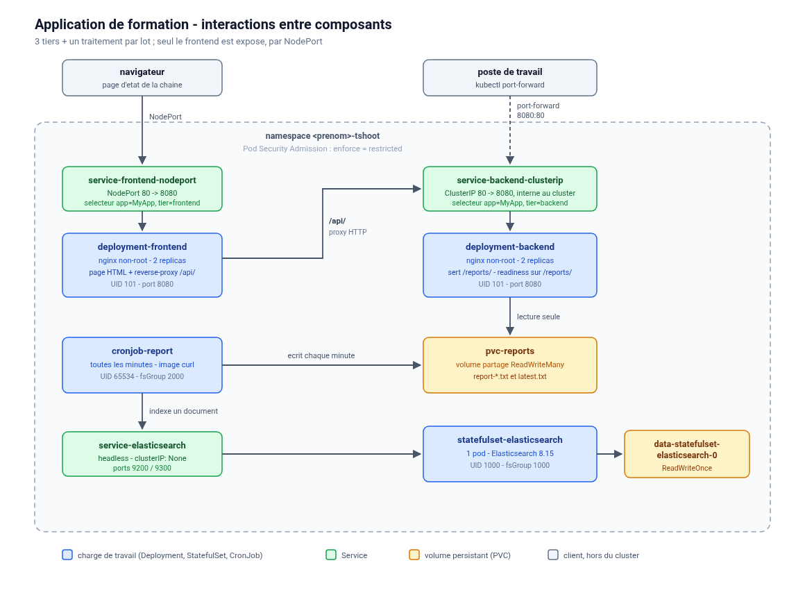

# TP de troubleshooting Kubernetes

Une application 3 tiers volontairement saine (`00-initial`), puis 13 copies de
cette application dans lesquelles une panne a été introduite. Les étudiants
installent une copie, constatent le symptôme, diagnostiquent avec `kubectl`,
puis corrigent le chart eux-mêmes.

| Dossier | Contenu |
|---|---|
| `00-initial/` | le chart Helm de référence, **il fonctionne parfaitement** |
| `01/` à `13/` | une copie du chart avec **une** panne — le chart seul, rien d'autre |
| `99-corriges/` | **ce dossier** : les énoncés, les corrigés, et ce document |
| `namespace-restricted.yaml` | le namespace de TP, avec Pod Security Admission `enforce: restricted` |
| `architecture.svg` / `.png` | le schéma ci-dessous |

Chaque dossier repart de `00-initial` : **les pannes ne sont pas cumulatives**.
`diff -ru 00-initial 07` montre exactement ce qui a été cassé.

> Ce document et les corrigés sont rangés dans `99-corriges/` à dessein : la
> solution n'est pas à portée de `ls` pendant la séance, et le déroulé se fait
> avec les slides. **Toutes les commandes ci-dessous se lancent depuis le
> répertoire `v2/`.**

---

## Ce que déploie le chart



Une application **3 tiers** plus un traitement par lot. Le point important pour
la formation : **chaque maillon cassé se voit depuis le navigateur**, et le
diagnostic se fait ensuite avec `kubectl`.

### Les quatre composants

**`deployment-frontend`** (nginx non-root, 2 replicas)
Sert une page HTML qui affiche en direct l'état de la chaîne : backend
joignable ou non, fraîcheur du dernier rapport, état du cluster Elasticsearch,
ainsi que l'`APPID` que le pod a reçu à son démarrage. La page se rafraîchit
toutes les 15 s et indique quel pod a répondu.
Il proxifie `/api/` vers le tier backend ; si celui-ci ne répond pas, il renvoie
une 503 explicite plutôt qu'une erreur brute.

**`deployment-backend`** (nginx non-root, 2 replicas)
Il n'est **pas exposé à l'extérieur** : seul le frontend l'appelle, par le nom
DNS de son Service ClusterIP. Pour le tester directement depuis un poste de
travail : `kubectl port-forward svc/service-backend-clusterip 8080:80`.
Monte le volume partagé **en lecture seule** et le publie sous `/reports/`.
Expose aussi `/healthz` et `/whoami`. Sa sonde *readiness* tape sur `/reports/`,
donc un problème de volume se traduit par un pod `Running` mais `0/1 Ready`.

**`cronjob-report`** (image curl, toutes les minutes)
1. vérifie qu'il peut écrire à la racine du volume partagé ;
2. interroge Elasticsearch (30 s d'attente maximum ; une indisponibilité n'est
   pas fatale, le rapport est quand même écrit) ;
3. crée l'index `formation-reports` s'il n'existe pas ;
4. écrit `report-<horodatage>.txt` et `latest.txt` sur le volume partagé ;
5. indexe un document dans Elasticsearch ;
6. ne conserve que les 20 derniers rapports.

Un rapport ressemble à ceci :

```
date          : 2026-09-21T13:08:23Z
job           : cronjob-report-29012345-abcde
attente ES    : 0s
elasticsearch : http://service-elasticsearch.<ns>.svc.cluster.local:9200
index         : formation-reports
cluster health: {"cluster_name":"formation-troubleshooting","status":"green",...}
documents     : {"count":3,...}   (avant ce run)
```

**`statefulset-elasticsearch`** (1 pod)
Elasticsearch 8.15 mono-noeud, sécurité désactivée (pas de mot de passe ni de
TLS à gérer en formation), avec son propre volume `ReadWriteOnce` créé par
`volumeClaimTemplates` et un Service **headless**.

### Ce qu'on voit quand tout marche

* la page du frontend : trois pastilles vertes ;
* `/api/reports/` sur le frontend : un fichier de plus chaque minute ;
* `kubectl get jobs -l tier=report` : des Jobs `Complete` ;
* `helm test monchart` : les 7 vérifications passent.

### Objets Kubernetes créés

| Type | Nom | Rôle |
|---|---|---|
| Deployment | `deployment-frontend`, `deployment-backend` | les deux tiers nginx |
| StatefulSet | `statefulset-elasticsearch` | Elasticsearch mono-noeud |
| CronJob | `cronjob-report` | le rapport, chaque minute |
| Service | `service-frontend-nodeport` | NodePort -> frontend |
| Service | `service-backend-clusterip` | ClusterIP -> backend, interne au cluster |
| Service | `service-elasticsearch` | headless (`clusterIP: None`) |
| PVC | `pvc-reports` | volume partagé **ReadWriteMany** |
| PVC | `data-statefulset-elasticsearch-0` | données Elasticsearch (créé par le StatefulSet) |
| ConfigMap | `configmap-myapp` | configuration applicative (APPID) |
| ConfigMap | `configmap-frontend`, `configmap-backend` | configurations nginx et pages HTML |
| ConfigMap | `configmap-elasticsearch` | paramètres Elasticsearch |
| ConfigMap | `configmap-report-script` | le script du CronJob |
| Secret | `secret-myapp` | mot de passe applicatif |
| Pod | `pod-test-connection` | créé et supprimé par `helm test` |

Trois images publiques, aucune image custom :
`nginxinc/nginx-unprivileged:1.27-alpine`, `curlimages/curl:8.11.1`,
`docker.elastic.co/elasticsearch/elasticsearch:8.15.3`.

---

## Les exercices

| # | Titre | Difficulté | Durée | Notion travaillée | |
|---|---|---|---|---|---|
| [01](01/README.md) | Le déploiement ne se termine jamais | `*....` | 10 min | `ImagePullBackOff`, événements du pod | [corrigé](01/corrige.md) |
| [02](02/README.md) | Le tier backend redémarre en boucle | `**...` | 15 min | `CrashLoopBackOff`, `logs --previous` | [corrigé](02/corrige.md) |
| [03](03/README.md) | Un pod qui redémarre sans raison apparente | `**...` | 15 min | sondes liveness / readiness / startup | [corrigé](03/corrige.md) |
| [04](04/README.md) | Des pods qui restent en Pending | `*....` | 10 min | scheduling, `requests` et `limits` | [corrigé](04/corrige.md) |
| [05](05/README.md) | Elasticsearch ne démarre plus après un ajustement | `***..` | 15 min | `OOMKilled`, mémoire d'une JVM en conteneur | [corrigé](05/corrige.md) |
| [06](06/README.md) | Le backend est en bonne santé mais injoignable | `***..` | 15 min | Service ClusterIP, sélecteurs, Endpoints | [corrigé](06/corrige.md) |
| [07](07/README.md) | Une 503 qui n'apparaît que dans les logs | `***..` | 15 min | logs applicatifs, `port` et `targetPort` | [corrigé](07/corrige.md) |
| [08](08/README.md) | La configuration a changé, l'application non | `***..` | 15 min | ConfigMap, `envFrom`, `rollout restart` | [corrigé](08/corrige.md) |
| [09](09/README.md) | Plus aucun rapport depuis ce matin | `**...` | 20 min | CronJob, Jobs, historique et logs | [corrigé](09/corrige.md) |
| [10](10/README.md) | Un Job qui ne crée aucun pod | `****.` | 15 min | Pod Security Admission, refus à l'admission | [corrigé](10/corrige.md) |
| [11](11/README.md) | Des pods évincés les uns après les autres | `****.` | 15 min | stockage éphémère, éviction | [corrigé](11/corrige.md) |
| [12](12/README.md) | Volume partagé saturé | `****.` | 20 min | volume RWX plein, extension d'un PVC | [corrigé](12/corrige.md) |
| [13](13/README.md) | Elasticsearch passe en lecture seule | `*****` | 25 min | disque plein, resize du volume d'un StatefulSet | [corrigé](13/corrige.md) |

### Déroulé proposé pour 4 h

Les 13 exercices représentent **3 h 25 de manipulation seule** : ils ne tiennent
pas en 4 h avec les rappels théoriques. Parcours conseillé, **10 exercices** :

| Temps | Contenu |
|---|---|
| 0:00 - 0:20 | Méthode de diagnostic : `get` / `describe` / `logs` / `events`, où chercher selon le symptôme |
| 0:20 - 1:00 | Exercices **01, 02, 03** - cycle de vie d'un pod et sondes |
| 1:00 - 1:15 | Rappel : `requests` / `limits`, QoS, éviction |
| 1:15 - 1:45 | Exercices **04, 05** |
| 1:45 - 2:00 | Pause |
| 2:00 - 2:15 | Rappel : Service, Endpoints, DNS interne |
| 2:15 - 2:45 | Exercices **06, 07** |
| 2:45 - 3:05 | Exercice **09** (CronJob) |
| 3:05 - 3:20 | Rappel : Pod Security Admission et profil `restricted` |
| 3:20 - 3:35 | Exercice **10** |
| 3:35 - 4:00 | Exercice **13** (le plus riche : disque plein et resize du volume d'un StatefulSet) |

Les exercices **08, 11 et 12** restent disponibles en bonus, ou pour remplacer
un exercice du parcours selon le public. Si la session est plus courte, les
exercices 01 à 06 forment un socle cohérent.

### Comment se déroule un exercice

```bash
cd v2/01
helm upgrade --install monchart . -n <prenom>-tshoot

# observer, diagnostiquer, corriger les fichiers du dossier 01, puis :
helm upgrade --install monchart . -n <prenom>-tshoot
```

On n'utilise volontairement ni `--wait` ni `--atomic` : avec ces options,
`helm upgrade` attendrait que tout soit `Ready` et annulerait la livraison de
lui-même, il n'y aurait plus rien à diagnostiquer. Une livraison cassée est
donc toujours signalée `deployed` par Helm — c'est normal, et ce n'est jamais
le symptôme.

L'énoncé (`99-corriges/<NN>/README.md`) donne le contexte, ce qu'il faut
constater et des questions pour guider la recherche. Le corrigé
(`99-corriges/<NN>/corrige.md`) donne la panne exacte, la démarche de
diagnostic pas à pas, la correction et un rappel théorique :
**il n'est pas distribué avant la fin de l'exercice**.

Les 13 exercices s'installent tous de la même façon : il n'y a jamais besoin de
désinstaller entre deux. **Corrigez chaque panne avant de passer à la suivante**
— certains effets survivent au changement de chart, par exemple un volume
partagé rempli (exercice 12), qui ferait échouer le CronJob de l'exercice
suivant pour une mauvaise raison.

Pour repartir totalement propre en fin de séance :

```bash
helm uninstall monchart -n <prenom>-tshoot
kubectl -n <prenom>-tshoot delete pvc --all
```

---

## Prérequis

* Kubernetes >= 1.25, Helm 3 ou 4.
* ~1,5 Gio de RAM pour Elasticsearch.
* Une **StorageClass ReadWriteMany** (`longhorn` par défaut, cf.
  `00-initial/values.yaml`). Le CronJob écrit à la racine de ce volume en
  **non-root** : cette racine doit donc être inscriptible. À vérifier une fois :

  ```bash
  kubectl get csidriver -o custom-columns=NAME:.metadata.name,FSGROUP:.spec.fsGroupPolicy
  ```

  `fsGroupPolicy=File` : bon. `ReadWriteOnceWithFSType` (le défaut) : `fsGroup`
  est ignoré sur un PVC RWX, il faut alors que le provisionneur crée la racine
  déjà inscriptible (beaucoup d'exports NFS la créent en 0777). Sinon, le
  CronJob s'arrête avec un diagnostic explicite dans ses logs.
* Pour les exercices 12 et 13 : une StorageClass avec
  `allowVolumeExpansion: true`.

## Installation

```bash
# le namespace, en mode restricted (une seule fois)
sed 's/<prenom>/antoine/' namespace-restricted.yaml | kubectl apply -f -

cd 00-initial
helm upgrade --install monchart . -n antoine-tshoot
```

Tout est dans `00-initial/values.yaml`, il n'y a pas d'autre fichier de valeurs
et rien à surcharger. Sur un cluster mono-noeud sans RWX réel (kind, minikube) :
ajouter `--set storage.reports.storageClassName= --set storage.elasticsearch.storageClassName=`.

## Vérification

```bash
kubectl -n antoine-tshoot rollout status deploy/deployment-backend --timeout=3m
kubectl -n antoine-tshoot rollout status statefulset/statefulset-elasticsearch --timeout=5m
kubectl -n antoine-tshoot rollout status deploy/deployment-frontend --timeout=3m

helm test monchart -n antoine-tshoot --logs

export NODE_IP=$(kubectl get nodes -o jsonpath='{.items[0].status.addresses[?(@.type=="InternalIP")].address}')
export FRONTEND_PORT=$(kubectl -n antoine-tshoot get svc service-frontend-nodeport -o jsonpath='{.spec.ports[0].nodePort}')
echo "frontend : http://$NODE_IP:$FRONTEND_PORT/"
echo "rapports : http://$NODE_IP:$FRONTEND_PORT/api/reports/"

# le backend n'est pas expose sur les noeuds : tunnel depuis le poste de travail
kubectl -n antoine-tshoot port-forward svc/service-backend-clusterip 8080:80
#   -> http://localhost:8080/reports/
```

Le premier rapport apparaît au bout d'une minute. Pour ne pas attendre :

```bash
kubectl -n antoine-tshoot create job --from=cronjob/cronjob-report report-manuel-1
kubectl -n antoine-tshoot logs job/report-manuel-1
```

## Désinstallation

```bash
helm uninstall monchart -n antoine-tshoot
# le PVC du StatefulSet n'est PAS supprime par Helm :
kubectl -n antoine-tshoot delete pvc data-statefulset-elasticsearch-0
```

---

## Pourquoi ces choix (namespace `restricted`)

Le namespace interdit root, les capabilities, l'escalade de privilèges, et
impose `seccompProfile`. D'où :

* **`nginxinc/nginx-unprivileged`** et non `nginx` : l'image standard démarre en
  root et écoute sur le port 80 (< 1024). Ici : UID 101, port 8080.
* **Aucun initContainer privilégié** pour Elasticsearch : le `chown -R` habituel
  est remplacé par `fsGroup: 1000`, et le `sysctl vm.max_map_count` par
  `node.store.allow_mmap: false`. `discovery.type: single-node` désactive en
  prime les *bootstrap checks*.
* **Même `fsGroup: 2000`** sur le backend et sur le CronJob, pour le volume partagé : c'est l'écrivain (le CronJob) qui en a réellement besoin.

## Pièges connus (utiles en TP)

* **Un pod refusé par Pod Security n'apparaît pas dans `kubectl get pods`.** Le
  Deployment, lui, est accepté : c'est le ReplicaSet (ou le Job) qui échoue à
  créer le pod. `kubectl describe rs -l tier=frontend`.
* **`Running` mais `0/1 Ready` sur le backend** = problème de volume (404 si le
  montage est absent, 403 s'il est illisible). Un volume qui ne se monte pas du
  tout laisse le pod **avant** `Running` (`ContainerCreating` + `FailedMount`).
* **Un PVC peut grandir, jamais rétrécir**, et la taille d'un
  `volumeClaimTemplates` de StatefulSet est immuable.
* **Ne pas modifier à la main un objet géré par Helm.** Helm 4 applique côté
  serveur : le champ change de propriétaire et les `helm upgrade` suivants
  échouent (`conflict with "kubectl-edit"`). Récupération :
  `helm upgrade --force-conflicts`.
* **`appName` finit dans `spec.selector`**, immuable : le changer sur une
  release installée fait échouer `helm upgrade`.
* **`envFrom` ignore silencieusement** les clés de ConfigMap qui ne sont pas des
  noms de variables valides (événement `InvalidEnvironmentVariableNames`).
* **Un seul release par namespace** : les noms des ressources sont fixes.
